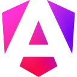

<h1>About Me</h1>

 

## 👋  Hey there, Welcome to my GitHub profile 

I’m a passionate full-stack developer with hands-on experience in enterprise-level software development.

<!-- 🎓 Graduate of B.Sc (Hons) Engineering, University of Moratuwa, Sri Lanka. -->

<!-- 💼 Former Lecturer & Associate Software Engineer at the Institute of Software Engineering (IJSE). -->

Interested in:
- Exploring and working with new technologies 
- Solving real-world problems through software  
- Sharing knowledge with the developer community 

I’m always sharpening my skills and staying up-to-date with the latest industry trends to build impactful software solutions.

🤝 Open to connecting with fellow developers, discussing exciting projects and exploring collaborative opportunities. Feel free to reach out to me via LinkedIn!

Thank you for visiting my GitHub profile, and I look forward to connecting with you!                                                                                        
 

## 🔍 Reach out to me
<!-- -->

 

  
## 🖥️ My DevSetup
  
 
   
 
 

 

## 🛠️ Languages, Technologies and tools
<code></code>
<code></code>
<code></code>
<code></code>
<code></code>
<code></code>
<code></code> 
<code></code>
<code></code>
<code></code>
<code></code>
<code></code>
<code></code>
<code></code>
<code></code>
<code></code>
<code></code>
<code></code>
<code></code>
<code></code>
<code></code>
<code></code>
<code></code>
<code></code>
<code></code>
<code></code>
<code></code>
<code></code>
<code></code>
<code></code>
<code></code>
<code></code>
<code></code>
<code></code>
<code></code>
<code></code>
<code></code>
<code></code>
<code></code>
<code></code>
<code></code>
<code></code>
<code></code>
<code></code>
<code></code>
<code></code>
<code></code>
<code></code>
<code></code>
<code></code>
<code></code>
<code></code>
<code></code>
<code></code>

<!-- <code></code> -->
<!-- <code></code> -->
<!-- <code></code> -->
<!-- <code></code> -->
<!-- <code></code> -->
<!-- <code></code> -->
<!-- <code></code> -->
      

 

## 📈 My GitHub Stats

<!--

 
-->

<!-- 
 

## 🏆 GitHub Trophies

-->

  

<!--  -->
